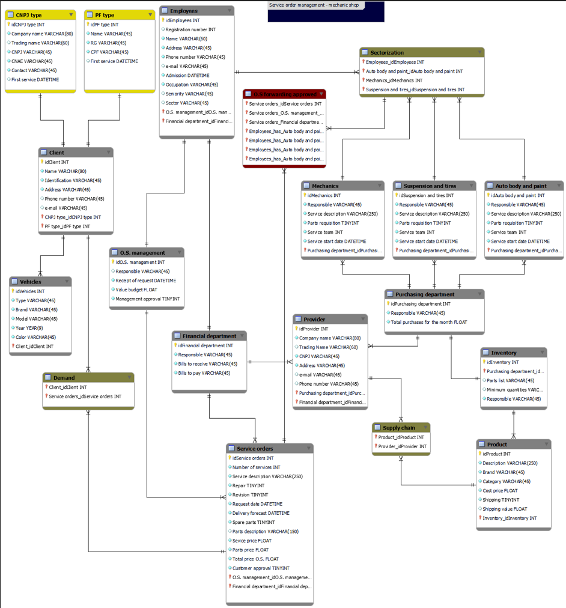

# Database Conceptual Project Service order management-mechanic shop-refined

Academic project for delivery

> Result of the finished project. This project aimed to fix knowledge in Entity Relationship Models enhanced with DB, using:
 
 

- [x] 
- [x]  - Workbench.

 
 

#### 🤝 Collaborators

<table>
  <tr>
    <td align="center">
      <a href="https://www.linkedin.com/in/edmar-radanovis-0130b611a/">
         
        
          <b>Edmar Radanovis</b>
        
      </a>
    </td>
    <td align="center">
       <a href="https://www.dio.me/">
         
        
          <b>DIO.me</b>
        
      </a>
  </tr>
</table>

[⬆ Voltar ao topo](#database-conceptual-project-service-order-management-mechanic-shop-refined) 
